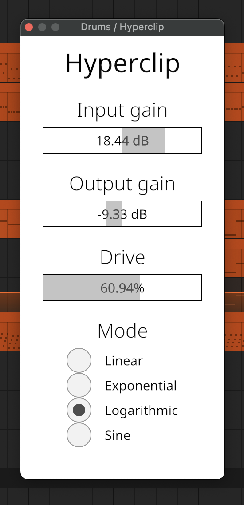

# Hyperclip

## Screenshot



## Features

Overflow distortion with 4 amplification modes:
- Linear
- Exponential
- Logarithmic
- Sine

## Quick start

Make sure you have [Rust](https://rust-lang.org/tools/install/) installed.

```bash
cargo xtask bundle hyperclip
```

This will build the plugin and create `target/bundled/hyperclip.clap` and
`target/bundled/hyperclip.vst3` bundles.
